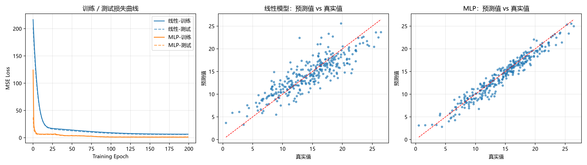

# 运行结果

## 模型结构
===== model1（线性模型）=====
Linear(in_features=10, out_features=1, bias=True)

===== model2（MLP）=====
Sequential(
  (0): Linear(in_features=10, out_features=64, bias=True)
  (1): ReLU()
  (2): Linear(in_features=64, out_features=32, bias=True)
  (3): ReLU()
  (4): Linear(in_features=32, out_features=1, bias=True)
)

## 评价对象与结果对比表

指标| 公式/含义 | 特点
----|----------|----
MSE|均方误差|对大误差敏感，即loss
RMSE|√MSE|量纲和 y 一致，解释平均差几个单位
MAE|平均绝对误差|对离群点更稳
R²|1 − SS_res/SS_tot|无量纲，越接近 1 越好，表示解释了多少方差，最适合做模型间对比

|模型 | 参数量 | 训练末loss  |  测试MSE  | 测试RMSE | 测试MAE |  测试R2|
|-----|-------|----------|-----------|-----------|---------|--------|
线性模型 | 11  | 6.5754   | 5.9731    |2.4440    | 1.9105    | 0.7383
MLP     |2817  |1.2474    | 1.4698   |  1.2124   |  0.9578   |  0.9356

Epoch        | 线性模型 (train / test)      | MLP (train / test)      
-------------|-------------------------|-------------------------
1            |   216.7007 /   202.2277 |   124.3504 /    37.3227
10           |    50.0029 /    48.1126 |     6.5955 /     6.3138
20           |    19.1372 /    18.2222 |     6.8601 /     5.9972
30           |    16.5937 /    15.0902 |     6.9181 /     5.5087
40           |    15.4294 /    13.8703 |     4.2493 /     4.0424
50           |    14.2930 /    12.7448 |     4.1949 /     3.8141
60           |    13.1008 /    11.6367 |     3.8492 /     3.4164
70           |    11.9895 /    10.5978 |     2.8577 /     3.0238
80           |    10.9321 /     9.6208 |     2.3391 /     2.5088
90           |    10.0704 /     8.7728 |     1.8818 /     1.9000
100          |     9.2666 /     8.0632 |     1.3301 /     1.6170
110          |     8.5836 /     7.4695 |     1.2612 /     1.3970
120          |     8.0129 /     6.9949 |     1.3160 /     1.3503
130          |     7.5798 /     6.6364 |     1.4244 /     1.3180
140          |     7.3043 /     6.3798 |     1.1688 /     1.2702
150          |     7.0581 /     6.1970 |     1.2028 /     1.2722
160          |     6.8448 /     6.0863 |     1.1037 /     1.2879
170          |     6.6826 /     6.0265 |     1.1402 /     1.2874
180          |     6.6316 /     5.9795 |     1.1070 /     1.3285
190          |     6.5954 /     5.9660 |     1.1955 /     1.3645
200          |     6.5754 /     5.9731 |     1.2474 /     1.4698

## 可视化

## 思考题
1.模型能力从哪里来
取决于模型结构假设空间的大小
2.更深是否意味着更强
不一定。如果堆叠很多线性层，等价于一个矩阵，表达能力和单个线性层没有本质区别，甚至因为更深的连乘导致梯度消失、更难训练。
3.模型越复杂越好吗
不是。
原因是训练集只有1050条样本，模型容量远超数据能支撑的复杂度后，它开始记住噪声而不是学到规律。超过这个点之后，多余的容量只会用来拟合噪声。