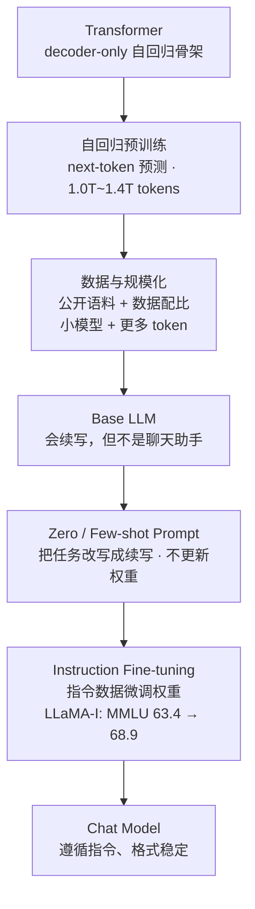

# LLaMA Reading

- 1.LLaMA 和原始 Transformer 的关系是什么？​
LLaMA 使用的是哪一类 Transformer 架构？它的训练目标是什么？为什么“预测下一个 token”可以成为生成文本、回答问题等能力的基础？​

①LLaMA只具有解码器(decoder),没有编码器(encoder);没有交叉注意力，只留下带因果掩码的自注意力(caual multi-head attention)。
②训练目标是预测下一个token。
③因为任一任务都可以被改写成一个续写问题，模型并不需要为每个任务单独设计输出层，只要它在海量文本上学到了什么样的前缀后面该接什么，就能在推理时通过续写出正确的答案。

- 2.LLaMA 相比你已经学习的 Transformer 做了哪些关键改动？​
请说明 RMSNorm、SwiGLU、RoPE 分别解决或改善了什么问题。无需推导公式，但需要说明它们在模型中的作用。

`Pre-normalization和RMSNorm`：原始Transformer是先算完子层、再对输出做LayerNorm，LLaMA改成对每个子层入口先归一化，并改用RMSNorm归一化函数(只按均方根缩放，比LayerNorm少了减均值和bias);`SwiGLU激活`：原始Transformer中的FFN是Linear→ReLU→Linear，而SwiGLU是门控结构：一路过 SiLU当“闸门”，另一路直接线性，两者相乘再降维，使得表达力更强，因此在同等算力下效果更好；代价是多了矩阵，所以论文把中间维度从 4d 缩到 2/3·4d 来抵消参数增长;`RoPE`：没有位置嵌入(position embedding),而替换成旋转位置嵌入(RoPE)。原始Transformer用固定的（或可学习的）绝对位置向量，加到输入嵌入上，只在最底层注入一次，它相对距的建模是隐式的，且很难外推到训练时没见过的长度。RoPE改为在每一层的 Q/K 上做旋转，让注意力分数只依赖两个位置的相对距离，位置表达更自然。

- 3.为什么 LLaMA 不只是“参数更多的 Transformer”？​
论文如何处理训练数据来源、数据配比、训练 token 数与模型参数量之间的关系？为什么足够多且高质量的数据对小一些的模型也很重要？​

①LLaMA选择的时相对小的模型，但训练更久，并看重推理速度，而不是参数量。
②数据只来源于公开数据，以原文的Table1为依据，数据来源和配比如下

| 数据来源 | 采样比例 |
| --- | --- |
| English CommonCrawl | 67.0% |
| C4 | 15.0% |
| GitHub | 4.5% |
| Wikipedia | 4.5% |
| Gutenberg + Books3 | 4.5% |
| ArXiv | 2.5% |
| Stack Exchange | 2.0% |

由原文的Figure1和Table2可以看出，33B和65B训练了1.4T token，而7B、13B也训练了1.0T token，且四条loss曲线都还没有明显饱和(batch size统一为4M token),说明不管模型的参数量如何，tokens数量都比较大。
③摘要中的最终结果：
> "LLaMA-13B outperforms GPT-3 (175B) on most benchmarks,
> and LLaMA-65B is competitive with the best models, Chinchilla-70B and PaLM-540B."

说明小模型依靠足够多且高质量的数据，也能达到与大模型相当甚至更高的准确性。

- 4.论文中的 zero-shot / few-shot 评测是怎样完成的？
选择论文中的一个评测任务说明：模型如何把一个分类、问答或推理任务转化为文本生成任务？这个过程是否更新了模型参数？它和微调有什么本质区别？​

①把每个评测任务改写成一段提示文本交给模型，让模型直接续写答案再拿续写出的内容和标准答案比对。分类任务取候选答案中概率最高的那个问答任务则直接比对生成的字符串。
zero-shot:提供任务的文字描述和测试示例,模型要么通过开放式生成给出答案，要么对提出的答案进行排名;few-shot:提供几个任务示例（介于1到64之间）和一个测试示例,模型将这些文本作为输入，生成答案或对不同选项进行排名。
②具体例子：闭卷问答
做法是把问题和答案拼成一段普通文本，zero-shot只给这一个问题，不给任何示例；few-shot在前面拼上若干条问题 + 答案的示例，
评测指标是Exact Match：当生成的字符串和标准答案完全一致才算正确。
结果在Table 4（NaturalQuestions和Table 5（TriviaQA中。以 Table 4里的LLaMA-65B为例，Exact Match 随示例数增加而稳步提升：**0-shot 23.8 → 1-shot 31.0 → 5-shot 35.0 → 64-shot 39.9**，而 GPT-3 175B 在 0-shot 上只有 14.6。这条曲线说明 few-shot 确实有效。
③并没有更新模型参数没有，zero-shot和few-shot只改动了提示词（上下文）。

| | Zero / Few-shot | Fine-tuning |
| --- | --- | --- |
| 改变的东西 | 输入上下文（提示词） | 模型权重 |
| 是否需要训练 | 不需要 | 需要反向传播和优化器 |
| 需要标注数据吗 | 几条示例即可 | 需要成规模的数据集 |
| 生效方式 | 每次推理现拼提示词 | 训练完固化成新权重 |
| 代价 | 提示词变长、占上下文 | 训练算力，存储一份新权重 |

- 5.预训练模型为什么不能直接等同于聊天助手？​结合论文中的 instructionfine-tuning 内容，说明 Base Model 与 Instruct Model 的区别。指令微调改变了模型的哪些部分，又没有改变哪些部分？

①Base Model只被训练过预测下一个 token。
②
> "Although the non-finetuned version of LLaMA-65B is already able to follow basic instructions,
> we observe that a very small amount of finetuning improves the performance on MMLU,
> and further improves the ability of the model to follow instructions."

说明base model不够稳定、格式不受控；极少量微调即可提升base model的性能变成instruct model，进一步增强模型执行指令的能力。
Table 10：

| 模型 | MMLU（5-shot） |
| --- | --- |
| LLaMA 65B（未微调） | 63.4 |
| Chinchilla 70B | 67.5 |
| Flan-PaLM-cont 62B | 66.1 |
| **LLaMA-I 65B（指令微调后）** | **68.9** |
| GPT code-davinci-002（当时 SOTA） | 77.4 |

③指令微调改变了的：

**权重本身**：从续写器的权重变成遵循指令的助手的权重；
**行为与格式**：更愿意直接给答案、更少自问自答、更容易被「请用……格式输出」这类要求约束住；
**任务表现**：在需要按指令作答的基准上（如 MMLU）明显提升。

没有改变的：

**模型结构与参数量**
**分词器与位置编码**：tokenizer、RoPE、上下文长度都不变；
**知识的主要来源**：新知识仍然主要来自预训练语料，指令微调的数据量很小。

## 链路总结图

